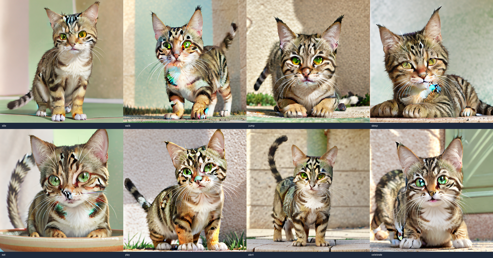
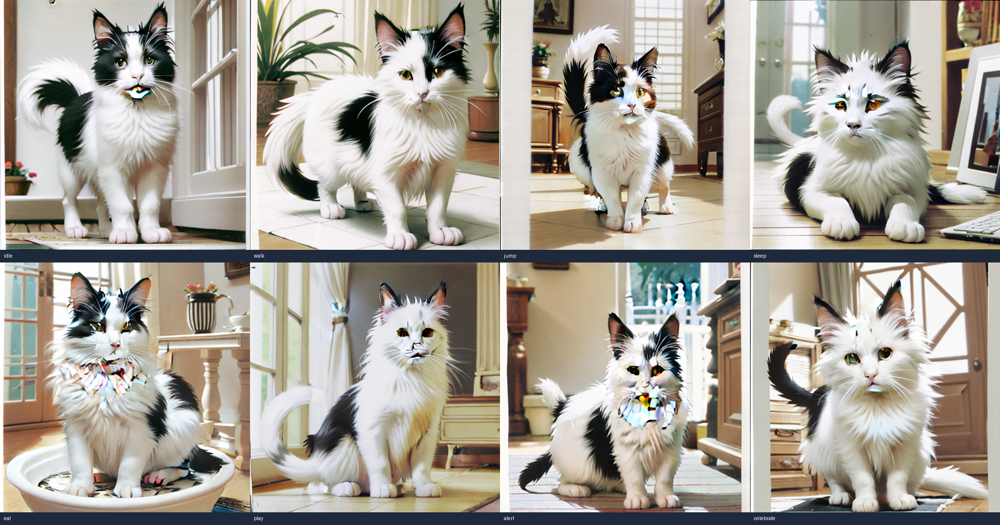
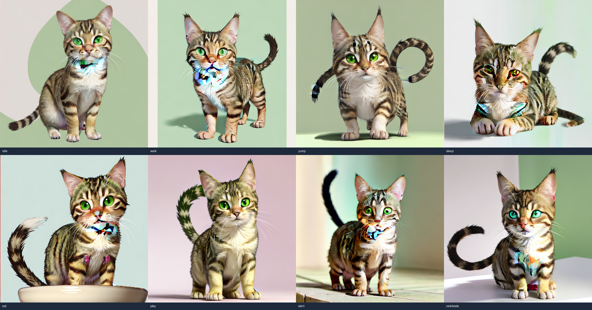
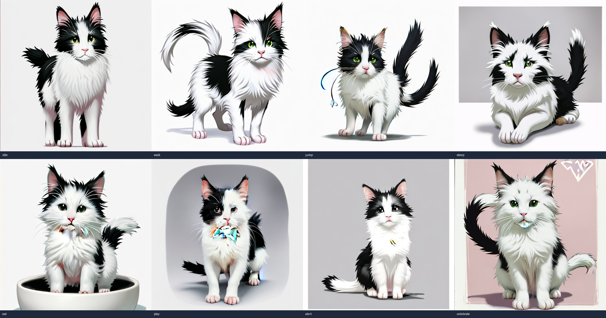

# V40.3R2 人工审计包

日期：2026-06-30

## 审计结论

原始门禁文档 `v40_3r2-final-implementation-gate-2026-06-30.md` 的结论是
诚实的，但单独阅读它不足以让人类完整审计本阶段自动化开发工作。

原因：

- 它没有展开候选资产索引和 contact sheet 入口；
- 它没有列出可复跑命令和预期退出结果；
- 它没有列出本阶段关键代码实体；
- 它没有把“生成成功”和“视觉验收失败”拆成独立审计项；
- 它没有提供资产尺寸与校验和，审计者难以确认正在查看同一批证据。

本文件修复上述缺口。审计者应把本文件和最终门禁文档一起使用。

## 完整证据链

| 审计环节 | 证据 |
| --- | --- |
| 计划和入口审计 | `docs/V40.x/evidence/v40_3r2-identity-runner-predev-audit-2026-06-30.md` |
| 默认候选生成和门禁 | `docs/V40.x/evidence/v40_3r2-identity-conditioned-repair-2026-06-30.md` |
| 默认候选视觉审查 | `docs/V40.x/evidence/v40_3r2-identity-conditioned-visual-review-2026-06-30.json` |
| Stylized retry 计划 | `docs/V40.x/evidence/v40_3r2-stylized-retry-predev-audit-2026-06-30.md` |
| Stylized retry 生成和门禁 | `docs/V40.x/evidence/v40_3r2-identity-conditioned-repair-stylized-2026-06-30.md` |
| Stylized retry 视觉审查 | `docs/V40.x/evidence/v40_3r2-identity-conditioned-stylized-visual-review-2026-06-30.json` |
| 最终失败门禁 | `docs/V40.x/evidence/v40_3r2-final-implementation-gate-2026-06-30.md` |
| 本人工审计包 | `docs/V40.x/evidence/v40_3r2-human-audit-package-2026-06-30.md` |

## 被审计范围

本阶段只审计 V40.3R2 identity-conditioned Direct Local Runner repair。

范围内：

- 修复无 WebUI / 无 ComfyUI 的本地 IP-Adapter 候选生成路径；
- 使用真实 V38 sanitized public cat samples 生成候选；
- 对默认候选和 stylized retry 做显式视觉审查；
- 根据 PRD/spec 判断能否进入 V40.4。

范围外：

- 任意猫照片自动生成高质量动作资产；
- Petdex parity；
- WebUI 或 ComfyUI 作为 active dependency；
- provider integration；
- 3D、production release、Windows、cross-platform readiness；
- V40.4-V40.7 的成功验收。

## 关键代码实体

| 实体 | 审计作用 |
| --- | --- |
| `scripts/v40_direct_runner_ip_adapter_candidates.py` | 本地 IP-Adapter img2img 候选生成器；输出 manifest、动作帧和 contact sheet。 |
| `scripts/v40_3r2_identity_conditioned_repair_smoke.mjs` | V40.3R2 包装脚本；负责生成/复用候选、读取视觉审查、写 evidence、决定 pass/fail。 |
| `apps/desktop/src/assets/v40-no-webui-workflow-contract.ts` | V40 no-WebUI 数据合同、候选摘要验证、视觉审查验证、claim/security scan。 |
| `docs/active/agent_desktop_pet_prd_v40.md` | 当前阶段权威 PRD。 |
| `docs/V40.x/v40-target-architecture.md` | 当前目标架构和 No-Go 状态。 |
| `docs/V40.x/v40-acceptance-plan.md` | V40.3R2 失败后的验收入口规则。 |

## 仓库状态

本审计包记录的是当前工作树中的 V40 阶段产物，不是已提交 release
产物。审计者需要知道这一点，否则会误以为所有证据已经在 git history
中固定。

当前工作树状态摘要：

- active docs 有修改：`docs/active/acceptance-plan.md`,
  `docs/active/current-vs-target-gap.md`, `docs/active/development-plan.md`,
  `docs/active/current-vs-target-gap.drawio`。
- V40 文档、证据、脚本和测试文件仍是未跟踪阶段产物，位于
  `docs/V40.x/`, `docs/active/agent_desktop_pet_prd_v40.md`,
  `scripts/v40_*`, `apps/desktop/src/assets/v40-*`。
- `.gitignore`, `apps/desktop/package.json` 和 `.tmp/` 也处于非 clean
  工作树状态；它们属于当前整体工作树背景，不应被误读为 V40.3R2
  视觉门禁通过证据。

代码和合同校验和：

| 文件 | SHA-256 |
| --- | --- |
| `scripts/v40_3r2_identity_conditioned_repair_smoke.mjs` | `04009e854668669b509901acfb9fea260e13eef109b6a02a376c28efb9bf6fe3` |
| `scripts/v40_direct_runner_ip_adapter_candidates.py` | `ba4acad61c5d8f956ca33c40f573bd68042acba4fbee6a72065f5cb52710134d` |
| `apps/desktop/src/assets/v40-no-webui-workflow-contract.ts` | `bb493f3d8ebfb5bd5a2d1a20209d8682a4655134c0b7b8425f54a5bd98de89c1` |

## 本地模型与适配器指纹

下表只记录非敏感模型标识和 SHA-256，不记录本地绝对路径。

| 组件 | 审计标识 | SHA-256 |
| --- | --- | --- |
| SD checkpoint | `dreamshaper-8-local-checkpoint` | `879db523c30d3b9017143d56705015e15a2cb5628762c11d086fed9538abd7fd` |
| IP-Adapter weight | `h94/IP-Adapter snapshot 018e402... / models/ip-adapter_sd15.bin` | `68e1df30d760f280e578c302f1e73b37ea08654eff16a31153588047affe0058` |
| IP-Adapter image encoder | `h94/IP-Adapter snapshot 018e402... / models/image_encoder/model.safetensors` | `6ca9667da1ca9e0b0f75e46bb030f7e011f44f86cbfb8d5a36590fcd7507b030` |

运行环境版本：

| 组件 | 版本 / 状态 |
| --- | --- |
| Python | `3.12.3` |
| Torch | `2.5.1+cu121` |
| CUDA available | `true` |
| CUDA version | `12.1` |
| GPU | `NVIDIA GeForce RTX 4090` |
| Diffusers | `0.35.2` |
| Transformers | `4.44.2` |
| Pillow | `12.2.0` |

生成配置：

| 路线 | steps | 尺寸 | init mode | IP-Adapter scale | strength | 输出目录 |
| --- | --- | --- | --- | --- | --- | --- |
| 默认 IP-Adapter | `24` | `512 x 512` | `blank` | `0.78` | `0.84` | `docs/V40.x/evidence/assets/v40-direct-ip-adapter-candidates-r2` |
| Stylized retry | `24` | `512 x 512` | `blank` | `0.54` | `0.96` | `docs/V40.x/evidence/assets/v40-direct-ip-adapter-candidates-r2-stylized` |

Seed 规则：

- `v38_a_cat_public`: `9040 + action_index`。
- `v38_tuxedo_public`: `9140 + action_index`。
- `action_index` 顺序为 `idle=0`, `walk=1`, `jump=2`, `sleep=3`,
  `eat=4`, `play=5`, `alert=6`, `celebrate=7`。
- 默认候选和 stylized retry 使用同一 seed 规则，但 IP-Adapter scale 与
  strength 不同。

复核命令使用 `V40_3R2_REUSE_EXISTING=1` 读取已生成 manifest，因此用于验证
门禁逻辑和视觉审查结论；若要重新生成图片，必须取消该变量，并接受扩散模型
输出可能因本地环境、依赖版本和 GPU kernel 差异出现细节差异。

## 可复跑命令

基础回归：

```bash
pnpm --filter desktop test
pnpm --filter desktop check
pnpm --filter @agent-desktop-pet/petctl test
pnpm --filter desktop exec node --import tsx ../../scripts/v30_semantic_animation_gate_smoke.mjs
pnpm --filter desktop exec node --import tsx ../../scripts/v39_8_final_gate_smoke.mjs
```

V40.3R2 默认候选复核。该命令应退出失败，因为视觉审查拒绝候选：

```bash
V40_3R2_REUSE_EXISTING=1 pnpm --filter desktop exec node --import tsx ../../scripts/v40_3r2_identity_conditioned_repair_smoke.mjs
```

V40.3R2 stylized retry 复核。该命令也应退出失败，因为视觉审查拒绝候选：

```bash
V40_3R2_VARIANT=stylized V40_3R2_REUSE_EXISTING=1 pnpm --filter desktop exec node --import tsx ../../scripts/v40_3r2_identity_conditioned_repair_smoke.mjs
```

注意：V40.3R2 smoke 的失败是正确门禁结果，不是测试基础设施失败。

本轮复核命令结果：

| 命令 | 实际退出码 | 关键结果 |
| --- | --- | --- |
| `pnpm --filter desktop test` | `0` | passed, 356 tests |
| `pnpm --filter desktop check` | `0` | passed |
| `pnpm --filter @agent-desktop-pet/petctl test` | `0` | passed, 71 tests |
| V30 semantic animation gate | `0` | passed |
| V39 final gate smoke | `0` | passed scoped |
| 默认候选复核 | `1` | `decision=failed`, `generatedCount=2`, `acceptedVisualCount=0`, `claimScanStatus=passed`, `securityScanStatus=passed` |
| Stylized retry 复核 | `1` | `decision=failed`, `generatedCount=2`, `acceptedVisualCount=0`, `claimScanStatus=passed`, `securityScanStatus=passed` |

完整原始终端日志未写入 evidence，原因是项目安全边界禁止保存 raw terminal
transcript、raw prompt、raw payload、full local path、token 或 Authorization。
审计者应使用上方命令复跑，并用退出码与 evidence 摘要交叉验证。

## 真实输入样本

| 样本 | 用途 |
| --- | --- |
| `v38-a-cat-public` | 第一只真实公共猫样本，用于同样本候选生成。 |
| `v38-tuxedo-public` | 第二只真实公共猫样本，用于同样本候选生成。 |
| `v38-negative-non-cat` | 负样本，应被记录为 blocked。 |

输入样本校验：

| 样本文件 | 尺寸 / 类型 | SHA-256 |
| --- | --- | --- |
| `docs/V38.x/evidence/assets/v38_a_cat_public/sanitized.png` | PNG, 512 x 512 | `95275f1d789517732171ff4f8d6718843d2dfa506e8d62aca725ae08f12f67a5` |
| `docs/V38.x/evidence/assets/v38_tuxedo_public/sanitized.png` | PNG, 512 x 512 | `e1656d8a9525e00075306ffacf869293432e58904796ef88b17721668a5243b0` |
| `docs/V38.x/evidence/assets/v38_negative_dog_public/original-sha256.txt` | negative source hash record file | `90b56047747572d8704d621956511cbdd3f27475721ba6c0134d7500a05166a7` |

负样本原始图像 hash 记录值：

```text
8291ffc6a5d24a3081f59379da2fd19c7c6c75b32bd3615806f7ef725a111ff5
```

## 生成资产索引

默认候选：

| 样本 | Contact sheet | 尺寸 | SHA-256 |
| --- | --- | --- | --- |
| `v38-a-cat-public` | `docs/V40.x/evidence/assets/v40-direct-ip-adapter-candidates-r2/v38-a-cat-public-contact-sheet.png` | 2048 x 1076 | `9d3b50160cd244f70ad109a665f9f69d6833d96c0d3daf3f7d018e07605d2667` |
| `v38-tuxedo-public` | `docs/V40.x/evidence/assets/v40-direct-ip-adapter-candidates-r2/v38-tuxedo-public-contact-sheet.png` | 2048 x 1076 | `1c3f6b5acb9627d77c24b025c1501b17b4186f840f262f24dfbc82e8ea801371` |

Stylized retry：

| 样本 | Contact sheet | 尺寸 | SHA-256 |
| --- | --- | --- | --- |
| `v38-a-cat-public` | `docs/V40.x/evidence/assets/v40-direct-ip-adapter-candidates-r2-stylized/v38-a-cat-public-contact-sheet.png` | 2048 x 1076 | `36ccbc8da5ac670c7f910c5f25296ca15d3c2e6e77f16ec8a94f5f907fed34e3` |
| `v38-tuxedo-public` | `docs/V40.x/evidence/assets/v40-direct-ip-adapter-candidates-r2-stylized/v38-tuxedo-public-contact-sheet.png` | 2048 x 1076 | `1b300e516fc2b0ac2b988d6ec0c3e73ac9ba7c9e36444fa69ca3e0e7ac0246f4` |

Manifest：

- `docs/V40.x/evidence/assets/v40-direct-ip-adapter-candidates-r2/manifest.json`
- `docs/V40.x/evidence/assets/v40-direct-ip-adapter-candidates-r2-stylized/manifest.json`

Manifest 和视觉审查校验：

| 文件 | SHA-256 |
| --- | --- |
| `docs/V40.x/evidence/assets/v40-direct-ip-adapter-candidates-r2/manifest.json` | `56200c3c69324c88ca83ff6dc897e33a77cef6317eec286f617bf3fd5a56d3de` |
| `docs/V40.x/evidence/assets/v40-direct-ip-adapter-candidates-r2-stylized/manifest.json` | `56200c3c69324c88ca83ff6dc897e33a77cef6317eec286f617bf3fd5a56d3de` |
| `docs/V40.x/evidence/v40_3r2-identity-conditioned-visual-review-2026-06-30.json` | `b07410949d937d4b27478835a5f1caeac4d7db0ac77496540b8b9def9745ad4b` |
| `docs/V40.x/evidence/v40_3r2-identity-conditioned-stylized-visual-review-2026-06-30.json` | `78606fd7ef317a3a0d268d5bd7c136a186a493127d1fbf1ff4e0ae00945b1e16` |

资产完整性：

- 默认候选目录和 stylized retry 目录合计 `38` 个文件。
- 每个样本在每条路线下各有 `8` 个动作 PNG。
- 每条路线各有 `2` 张 contact sheet 和 `1` 个 manifest。

每个样本均包含八个动作文件：

- `idle`
- `walk`
- `jump`
- `sleep`
- `eat`
- `play`
- `alert`
- `celebrate`

## 逐动作 PNG 指纹

该表用于确认 manifest 指向的单动作 PNG 没有被替换。Contact sheet
只能证明视觉审查入口，不能单独证明每个动作帧文件的完整性。

| 文件 | 尺寸 | SHA-256 |
| --- | --- | --- |
| `docs/V40.x/evidence/assets/v40-direct-ip-adapter-candidates-r2-stylized/v38-a-cat-public-contact-sheet.png` | `2048 x 1076` | `36ccbc8da5ac670c7f910c5f25296ca15d3c2e6e77f16ec8a94f5f907fed34e3` |
| `docs/V40.x/evidence/assets/v40-direct-ip-adapter-candidates-r2-stylized/v38-a-cat-public/alert.png` | `512 x 512` | `143f72fcd336def8d1f1d8362430d4e7810538e6751fba04bf6a91a34b5114cc` |
| `docs/V40.x/evidence/assets/v40-direct-ip-adapter-candidates-r2-stylized/v38-a-cat-public/celebrate.png` | `512 x 512` | `f198721d4995bcaf551906c1205990fa51a3d9aab7cbe8be34cfe9fb90f8e254` |
| `docs/V40.x/evidence/assets/v40-direct-ip-adapter-candidates-r2-stylized/v38-a-cat-public/eat.png` | `512 x 512` | `ec341500aa37b8bee4982e0d5eb4816fc436b445ab60990e3e19cce21a6fd8c0` |
| `docs/V40.x/evidence/assets/v40-direct-ip-adapter-candidates-r2-stylized/v38-a-cat-public/idle.png` | `512 x 512` | `ab3ad190559513b2398cabe98dd7572d229aa0d4bf981dcd99abdb00c1d07c9d` |
| `docs/V40.x/evidence/assets/v40-direct-ip-adapter-candidates-r2-stylized/v38-a-cat-public/jump.png` | `512 x 512` | `46b1bbf731041ada69fc7daf0f0f81bf7060efcbc829cbae3048b65dc17aadb1` |
| `docs/V40.x/evidence/assets/v40-direct-ip-adapter-candidates-r2-stylized/v38-a-cat-public/play.png` | `512 x 512` | `0163f68fbef80ce4fc0eeaff2112591c88c137fc636337be40e47e6a8ab13dc6` |
| `docs/V40.x/evidence/assets/v40-direct-ip-adapter-candidates-r2-stylized/v38-a-cat-public/sleep.png` | `512 x 512` | `3e1861802b66eeffac15fb9a947beb7c4e918708eb1c090b69f790923e987180` |
| `docs/V40.x/evidence/assets/v40-direct-ip-adapter-candidates-r2-stylized/v38-a-cat-public/walk.png` | `512 x 512` | `353b61e80758d88903a01369456a9fdf3fd9ed213669573b40c68332af8b9d45` |
| `docs/V40.x/evidence/assets/v40-direct-ip-adapter-candidates-r2-stylized/v38-tuxedo-public-contact-sheet.png` | `2048 x 1076` | `1b300e516fc2b0ac2b988d6ec0c3e73ac9ba7c9e36444fa69ca3e0e7ac0246f4` |
| `docs/V40.x/evidence/assets/v40-direct-ip-adapter-candidates-r2-stylized/v38-tuxedo-public/alert.png` | `512 x 512` | `5ff97da401690111212f46c3d8ac49091a3210bdaac245c21e0258c906ba67c1` |
| `docs/V40.x/evidence/assets/v40-direct-ip-adapter-candidates-r2-stylized/v38-tuxedo-public/celebrate.png` | `512 x 512` | `d9808a512fd77736348b26f32f5e3fb144aaaf4b0e8866509b889a442017189a` |
| `docs/V40.x/evidence/assets/v40-direct-ip-adapter-candidates-r2-stylized/v38-tuxedo-public/eat.png` | `512 x 512` | `4d37568e8703cd2aaf4e5536a62e27da0949b7e217f6f3b77fbf7e8ec05a8a99` |
| `docs/V40.x/evidence/assets/v40-direct-ip-adapter-candidates-r2-stylized/v38-tuxedo-public/idle.png` | `512 x 512` | `8972789b16622e1dbf62d603e13b81bc8ffade22c06a00245dbbadd0442e9189` |
| `docs/V40.x/evidence/assets/v40-direct-ip-adapter-candidates-r2-stylized/v38-tuxedo-public/jump.png` | `512 x 512` | `4dfb98d1846eda9ac53098fa58792d3055bef5736e4b6a2ce91ab95a95f118ce` |
| `docs/V40.x/evidence/assets/v40-direct-ip-adapter-candidates-r2-stylized/v38-tuxedo-public/play.png` | `512 x 512` | `8f306d269be36be6967e49840b250f1d1111a503ba2f591c3dbda5021c618ad1` |
| `docs/V40.x/evidence/assets/v40-direct-ip-adapter-candidates-r2-stylized/v38-tuxedo-public/sleep.png` | `512 x 512` | `93cd68afcdabc1aa72d8a9976010f69a5943bc2db1771447297d165534b8c820` |
| `docs/V40.x/evidence/assets/v40-direct-ip-adapter-candidates-r2-stylized/v38-tuxedo-public/walk.png` | `512 x 512` | `a1d8a13d02272986bacbedb0d92298913dce1e422460e60793ec18a9861d5d96` |
| `docs/V40.x/evidence/assets/v40-direct-ip-adapter-candidates-r2/v38-a-cat-public-contact-sheet.png` | `2048 x 1076` | `9d3b50160cd244f70ad109a665f9f69d6833d96c0d3daf3f7d018e07605d2667` |
| `docs/V40.x/evidence/assets/v40-direct-ip-adapter-candidates-r2/v38-a-cat-public/alert.png` | `512 x 512` | `773df115630b3c251670601ea65e4601ce29ca7e0f91967e411a9c3a7b0acf55` |
| `docs/V40.x/evidence/assets/v40-direct-ip-adapter-candidates-r2/v38-a-cat-public/celebrate.png` | `512 x 512` | `7b23ee8436f71f6f445cc07e148e9cfa927ccab54f9c1db239739825194ae9d9` |
| `docs/V40.x/evidence/assets/v40-direct-ip-adapter-candidates-r2/v38-a-cat-public/eat.png` | `512 x 512` | `77736930e3056633a97dd260c21187caa855ff68afd7f5a0a2dc75b3780b5488` |
| `docs/V40.x/evidence/assets/v40-direct-ip-adapter-candidates-r2/v38-a-cat-public/idle.png` | `512 x 512` | `1b7f5ea75d8aa52b1798e862016a2d7ffab1be49f5e9e8f21f482d32bebcef59` |
| `docs/V40.x/evidence/assets/v40-direct-ip-adapter-candidates-r2/v38-a-cat-public/jump.png` | `512 x 512` | `1573c23c4f3c8f9c3c46110869bde895b1ac601e5d68da3bcd3d0f211c0d2af3` |
| `docs/V40.x/evidence/assets/v40-direct-ip-adapter-candidates-r2/v38-a-cat-public/play.png` | `512 x 512` | `8944b5c1659d4e163e3f60094467a769b85e188a76391cf6a703fed69bb18373` |
| `docs/V40.x/evidence/assets/v40-direct-ip-adapter-candidates-r2/v38-a-cat-public/sleep.png` | `512 x 512` | `77b2d34a4a1fb7ac913c2dee1d778b3350401539359facaeeb5ba099fb067b02` |
| `docs/V40.x/evidence/assets/v40-direct-ip-adapter-candidates-r2/v38-a-cat-public/walk.png` | `512 x 512` | `a137404163b0e0e7c0b98adb3b111eb4abbdeae1e32d91edee206e125b6569df` |
| `docs/V40.x/evidence/assets/v40-direct-ip-adapter-candidates-r2/v38-tuxedo-public-contact-sheet.png` | `2048 x 1076` | `1c3f6b5acb9627d77c24b025c1501b17b4186f840f262f24dfbc82e8ea801371` |
| `docs/V40.x/evidence/assets/v40-direct-ip-adapter-candidates-r2/v38-tuxedo-public/alert.png` | `512 x 512` | `bb7f33e3753f9c207da6e44b193b636ef3a186ce540abf187129db87fde56ad5` |
| `docs/V40.x/evidence/assets/v40-direct-ip-adapter-candidates-r2/v38-tuxedo-public/celebrate.png` | `512 x 512` | `48bfea6dadb66188823460cbba81e8bbb9fbf382e2dabdbb2808f4533583f1d2` |
| `docs/V40.x/evidence/assets/v40-direct-ip-adapter-candidates-r2/v38-tuxedo-public/eat.png` | `512 x 512` | `5ac4fb4d8de6dbb1b8a0258915be5eb2023df1cc87b1618ef525975d386fdcef` |
| `docs/V40.x/evidence/assets/v40-direct-ip-adapter-candidates-r2/v38-tuxedo-public/idle.png` | `512 x 512` | `014494005c0bdb90004c77904d9acc3eda5e33b162ef48cda93387dde1ef6ea9` |
| `docs/V40.x/evidence/assets/v40-direct-ip-adapter-candidates-r2/v38-tuxedo-public/jump.png` | `512 x 512` | `aef555fe49f70acb1a6a692caf6cbe2f36546058fc550ce5f66d46e8f11b492f` |
| `docs/V40.x/evidence/assets/v40-direct-ip-adapter-candidates-r2/v38-tuxedo-public/play.png` | `512 x 512` | `3628f2a0e6837f22d08005f528122b43157187f1e6be48bfa77ca73dd95c854c` |
| `docs/V40.x/evidence/assets/v40-direct-ip-adapter-candidates-r2/v38-tuxedo-public/sleep.png` | `512 x 512` | `71867f0928c0acf795a034ffd3143b669051d524e78994482cc78de3fe9c3d13` |
| `docs/V40.x/evidence/assets/v40-direct-ip-adapter-candidates-r2/v38-tuxedo-public/walk.png` | `512 x 512` | `7818366281c06535444ec0d464044fa88b121e88d7c49a15094c7d58078b8d2d` |

## 视觉证据预览

默认 IP-Adapter / `v38-a-cat-public`：



默认 IP-Adapter / `v38-tuxedo-public`：



Stylized retry / `v38-a-cat-public`：



Stylized retry / `v38-tuxedo-public`：



## 视觉审查结果矩阵

| 路线 | 样本 | 生成结果 | 视觉结果 | 失败原因 |
| --- | --- | --- | --- | --- |
| 默认 IP-Adapter | `v38-a-cat-public` | generated | failed | 仍像室内猫照片；多帧近景/裁切；jump/eat/play/alert/celebrate 动作不清晰；口鼻/颈部有伪影。 |
| 默认 IP-Adapter | `v38-tuxedo-public` | generated | failed | 背景和室内物体明显；动作语义弱；口鼻/胸部有伪影；不适合归一化为干净动作包。 |
| Stylized retry | `v38-a-cat-public` | generated | failed | 背景有所减少，但仍偏半照片；口鼻/胸部/身体伪影；eat/play/alert/celebrate 不可读。 |
| Stylized retry | `v38-tuxedo-public` | generated | failed | 更像插画，但有容器/面板/标记伪影；八动作语义仍不可靠。 |

原始视觉审查文件：

- `docs/V40.x/evidence/v40_3r2-identity-conditioned-visual-review-2026-06-30.json`
- `docs/V40.x/evidence/v40_3r2-identity-conditioned-stylized-visual-review-2026-06-30.json`

## PRD / Spec 对照

| PRD / Spec 要求 | 当前证据 | 审计判断 |
| --- | --- | --- |
| 至少两个同样本候选通过显式视觉审查后才能进入 V40.4 | 0 个候选通过视觉审查 | fail，V40.4 No-Go |
| 八个动作必须在桌面宠物尺度可读 | 四个候选均有多个动作不可读 | fail |
| 输出不得只是照片卡片、背景图或原始生成图 dump | 默认候选明显有照片/背景问题，stylized retry 仍有伪影 | fail |
| V40 输出需相对 V39 有明确人类偏好优势 | 未达到可声明优势 | fail |
| 失败候选不得进入产品 apply | V40.4-V40.7 已锁定 No-Go | pass for safety |

## Claim / Security 审计结论

Claim 审计：

- 未声明 Petdex parity；
- 未声明任意猫照片自动生成 ready；
- 未声明 provider integration verified；
- 未声明 WebUI/ComfyUI ready；
- 未声明 3D、production、Windows、cross-platform ready。

Security 审计：

- evidence 使用相对路径引用候选资产；
- 未写入 token、Authorization value、raw prompt、raw payload、raw photo bytes、credential content。

## 人类审计步骤

1. 打开四张 contact sheet，确认是否存在照片背景、裁切、伪影、动作不可读问题。
2. 对照两个 visual review JSON，确认每个失败原因是否能从图像中观察到。
3. 打开两个 manifest，确认每个候选确实包含八个动作文件。
4. 复跑 V40.3R2 reuse smoke，确认退出失败且失败原因是视觉审查拒绝。
5. 复跑基础回归命令，确认 V30/V39 baseline 未被破坏。
6. 检查 active docs，确认 V40.4-V40.7 没有被错误打开。

## 仍不可由本文件证明的事项

这些事项不是本阶段通过证据，审计者不应从本文件推导出成功结论：

- 不能证明任意猫照片自动生成高质量动作资产；
- 不能证明生成结果达到 Petdex 级资产质量；
- 不能证明 V40.4 归一化、V40.5 产品应用、V40.6 可视化成功报告或
  V40.7 final pass；
- 不能证明 WebUI、ComfyUI、provider、3D、production、Windows 或
  cross-platform readiness；
- 不能证明用户会喜欢当前 V40.3R2 候选资产。

## 最终审计判断

本阶段自动化开发工作可以被审计为：

- runner compatibility repair：完成；
- real candidate generation：完成；
- target visual experience：失败；
- V40.4 entry：不允许；
- final V40 image-to-action quality claim：不允许。

这不是一个通过报告，而是一个失败门禁报告。当前项目仍不能声明已经实现高质量图生 2D 动作资产生成。
